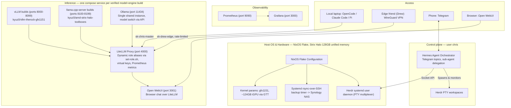

# local-ai-machine

Config-as-code and benchmark catalog for a home-lab local AI inference box: an AMD Ryzen
AI Max+ 395 ("Strix Halo", `gfx1151`) mini-PC with 128GB of unified LPDDR5X memory, running
NixOS and serving multiple LLMs side by side (vLLM, llama.cpp, and Ollama) for coding-
assistant use and cross-engine/cross-model comparison.

**Host**: `local-ai-machine` (AMD Ryzen AI Max+ 395, 128GB unified RAM, 2TB NVMe). Connect
via `ssh local-ai-machine` (uses the `local-ai-machine` alias in `~/.ssh/config` → user
`chris`). Don't use `local-ai-machine.local` directly with a local Mac username — that
alias/user combo isn't configured and fails with a misleading `Permission denied`.

## Design principles

1. **Cattle, not pets.** The whole host OS is declared via a Git-backed Nix Flake
   (`flake.nix` / `configuration.nix`). A fresh install converges to the same state via
   `nixos-rebuild switch` alone.
2. **Unified memory allocation.** The Strix Halo APU shares 128GB of LPDDR5X between CPU
   and iGPU. BIOS `iGPU Configuration` must be `UMA_SPECIFIED` with the smallest `UMA Frame
   Buffer Size` (1GB) — `Auto` silently reserves a fixed 64GB. Kernel params
   (`amdgpu.gttsize`, `ttm.pages_limit`, `amd_iommu=off`) then let the GPU draw dynamically
   on nearly the full ~124GB via GTT.
3. **Headless.** No desktop/display manager — GPU memory goes to inference, not a GUI.
4. **Strict declarative state.** No manual `apt`/`pip`/ad-hoc `systemctl` edits on the host
   outside `configuration.nix`/`docker-compose.yml`. See `AGENTS.md` for the full
   git-mediated-changes workflow any agent (or human) working on this repo should follow.
5. **Secrets hygiene.** Passwords, tokens, and keys live in `secrets/` (gitignored,
   `.example` templates tracked) or `.env` files — never in tracked config.

## Repository layout

```text
local-ai-machine/
├── flake.nix                  # Flake entrypoint
├── configuration.nix          # Declarative OS: kernel params, users, model downloads,
│                               # firewall, systemd services/timers, backups
├── hardware-configuration.nix # Auto-generated host hardware specs
├── secrets/                   # Gitignored credentials; .example templates tracked
├── docker/
│   ├── docker-compose.yml     # One service per verified model+engine build, plus
│   │                           # gateway/observability infrastructure
│   ├── .env.example           # Template for the secrets docker-compose.yml needs
│   ├── litellm/config.yaml    # Model routes, dynamic role aliases, virtual keys
│   ├── prometheus/prometheus.yml
│   └── grafana/dashboards/
├── catalog/                   # Versioned benchmark catalog (engines/builds/benchmarks)
│   ├── OPERATIONS.md           # Safety-critical preflight/teardown procedure — read
│   │                           # before running or scripting any benchmark
│   ├── engines/*.yaml          # Reusable engine+backend recipes (vLLM, llama.cpp
│   │                           # variants, Ollama variants)
│   ├── builds/*.yaml           # One file per verified model+engine combination
│   ├── benchmarks/*.yaml       # Versioned benchmark methodology definitions
│   ├── agentic-tasks/          # Task definitions for the agentic-orchestration benchmark
│   └── raw/                    # Raw benchmark run output
├── knowledge/                  # Structured institutional memory (decisions/research/
│   │                           # context) — see `knowledge/README.md`
├── docs/                       # Generated benchmark/comparison HTML reports
├── scripts/                    # Operational + benchmarking scripts (see below)
└── .fleet/                     # Fleet board (task tracking) — see AGENTS.md
```

## System topology



## Declarative system configuration (`configuration.nix`)

The `models` list (a top-level `let` binding) declares every model this box downloads —
each entry becomes a self-triggering, idempotent `download-model-<name>` systemd service
(oneshot, timer-triggered, resumable, verified via `.incomplete` marker / shard-manifest
checks rather than trusting `hf download`'s exit code alone) plus a shared-`flock`-
serialized download queue so multiple downloads never saturate the network at once.
`configuration.nix` itself is the source of truth for exactly which models are currently
approved/downloading — check it directly rather than this document for the current list.

Key mechanisms, all load-bearing:
- **Timer-triggered, not `wantedBy multi-user.target`.** Both the download services and
  `docker-compose-app` (which brings the whole Docker Compose stack up on a fresh boot)
  are armed via `systemd.timers` with `OnBootSec`, and set `restartIfChanged = false`.
  Without this, `nixos-rebuild switch` blocks synchronously on starting/restarting any
  long-running unit — an in-flight multi-GB download would turn an unrelated config push
  into a 15-40 minute stall.
- **`docker-compose-app` polls `.download-complete` marker files** rather than expressing
  "wait for downloads" via `after=`/`wants=` — those retry indefinitely on failure, so
  systemd ordering against them only proves "the most recent attempt exited," not
  "eventually succeeded."
- **Passwordless `sudo`** is scoped to exactly two things: the literal
  `nixos-rebuild switch --flake /etc/nixos#local-ai-machine` command, and
  `systemctl start`/`stop`/`restart` (not `enable`/`disable`/`edit`/masking) — the latter
  needed because pausing/resuming download units for a benchmark run requires it.
- **Firewall**: `networking.nftables.enable = true` plus
  `networking.firewall.filterForward = true` are both required for `allowedTCPPorts` to
  mean anything for Docker-published ports at all — Docker manages its own FORWARD-chain
  iptables/nftables rules that otherwise bypass the NixOS firewall entirely. Model-serving
  ports (vLLM/llama.cpp builds, 8000-8199) are bound to `127.0.0.1` only in
  `docker-compose.yml`, not exposed on the LAN — reachable via SSH tunnel or `docker exec`
  only. LiteLLM (port 4000) is the one intended authenticated gateway.
- **`HF_HUB_DISABLE_XET=1`** — hf-xet (HuggingFace's newer accelerated transfer backend)
  hangs repeatedly on this network path; plain HTTP with longer timeouts is the reliable
  path here.
- **`hfExclude`/`hfFiles`** on a model entry let a download skip irrelevant files in a repo
  (e.g. GPT-OSS's redundant Apple-Metal/full-precision copies) or pull a single file instead
  of a whole repo (e.g. one GGUF quant out of a repo with many).

## Containerized runtime stack (`docker/docker-compose.yml`)

**Two-tier design**: every verified model+engine build is its own Compose service with a
fixed host port (vLLM builds: 8000-8099; llama.cpp-server: 8100-8199; Ollama: single shared
instance on 11434). Only the service actually in use needs to be started — everything else
stays defined-but-stopped. LiteLLM aliases stable role names (`coder`, `judge`, etc.) to
whichever port is the current pick for that role; switching roles is a LiteLLM config edit
via `scripts/set-role.sh`, not a Compose change or a redeploy. See `docker/docker-compose.yml`
itself for the exact current model lineup, flags, and port allocations — it changes as
models are added/benchmarked, and is the authoritative source, not this document.

GPU contention constraints: at most one vLLM build and one llama.cpp-server build can
co-reside on the GPU at a time; Ollama's footprint is small enough to run alongside either.
Judge-sized models (roughly <25B total) carry an explicit low
`--gpu-memory-utilization` cap so they don't starve whatever they're running alongside.

**Gateway (LiteLLM, `docker/litellm/config.yaml`)**: routes every build's fixed port under
its own model name, plus a small set of stable role aliases (`coder`, `judge`, a cloud
fallback route). `scripts/set-role.sh <role> <service-name>` repoints a role at a different
build by reading the port straight out of `docker-compose.yml` — no manual port lookup, no
separate config format to keep in sync. Virtual keys (`sk-chris-master`, `sk-drew-edge`) are
generated at runtime via LiteLLM's `/key/generate` API against the master key, not declared
in `config.yaml`.

**Observability**: Prometheus scrapes vLLM/LiteLLM/`node-exporter` targets; `node-exporter`
combines its built-in hwmon collector (GPU temp/power/clock, free) with a custom
textfile-collector script (`scripts/amdgpu-metrics.sh`) for amdgpu-specific sysfs values
(`gpu_busy_percent`, GTT/VRAM used) that hwmon doesn't cover — `rocm-smi`'s own VRAM metric
is not useful on this unified-memory APU (it only reports the tiny static BIOS carve-out).
Grafana is provisioned against Prometheus with a dashboard covering request/token
throughput, KV cache usage, latency percentiles, and host/GPU utilization.

**Open WebUI**: browser chat UI pointed at LiteLLM's unified OpenAI-compatible endpoint,
not any model server directly — every role/model alias is reachable from one place.

## Hermes config & sub-agent delegation

`~/.hermes/USER.md` on the box defines Hermes' provider routing and sub-agent delegation
policy: LiteLLM directly, for chat/session-memory/read-only queries as well as autonomous
background sub-agents that modify files or run builds (a separate governed route through
Turnstone previously sat in front of LiteLLM for that autonomous-sub-agent traffic; Turnstone
has since been decommissioned). Multi-file engineering or shell-modifying requests get
delegated to a sub-agent rather than executed directly in the parent context; Herdr panes are
spawned via socket API when live human visibility into a running agent is useful, and
completion summaries/diffs get reported back to the originating Telegram topic.

## Operational scripts (`scripts/`)

- **`set-role.sh`** — repoint a LiteLLM role alias at a different running build (see above).
- **`benchmark_orchestrator.py`** — resumable, safety-procedure-aware orchestrator that runs
  the benchmark catalog's builds end-to-end (preflight download-pause, correct
  teardown/restore sequencing, run-fingerprint capture, YAML-surgery appends to each
  build's `benchmark_runs:`). Supports `--dry-run` and `--only <build-id>`.
- **`coding_benchmark.py`** — the coding-assistant capability harness (multi-tier: code
  correctness, tool-calling, judge-role fitness, personal-assistant fitness, multi-turn
  debugging, planning/clarification fitness), run against any model's OpenAI-compatible
  endpoint.
- **`agentic_coding_benchmark.py` / `agentic_orchestration_benchmark.py`** — higher-level
  agentic-harness benchmarks (see `catalog/agentic-tasks/`).
- **`generate_comparison_dashboard.py`** — builds the cross-model comparison HTML reports
  in `docs/`.
- **`ollama_register_model.sh`** — registers a downloaded GGUF with Ollama
  (`ollama create`) once its `.download-complete` marker appears.
- **`amdgpu-metrics.sh`** — writes amdgpu-specific sysfs metrics as a node-exporter
  textfile-collector file (see Observability above).
- **`sync-backup.sh`** — manual trigger for the rsync-over-SSH backup mirror to Synology.
- **`migrate_catalog_to_versioned.py`** — one-time migration script (versioned catalog
  schema, M-002); kept for reference.
- **`reset_agentic_test_repo.sh`** — resets the separate sandbox repo used by the
  git-pr-ci agentic benchmark task.

## Benchmark catalog (`catalog/`)

A versioned, structured record of every model+engine combination that's been verified to
run on this hardware, replacing an earlier flat `MODEL_STACK_CATALOG.md`/`BENCHMARKING.md`
pair:
- **`engines/*.yaml`** — reusable engine+backend recipes (vLLM; llama.cpp in multiple
  backend variants; Ollama, including a documented-broken variant).
- **`builds/*.yaml`** — one file per model+engine combination: identity/config plus a
  `benchmark_runs[]` array of real, dated results with full run-fingerprint metadata.
- **`benchmarks/*.yaml`** — versioned methodology definitions (e.g. a speed-benchmark
  protocol, a multi-tier coding-capability protocol) — versioned so methodology changes
  don't invalidate prior comparisons silently.
- **`agentic-tasks/`** — task definitions for the agentic-orchestration benchmark (a
  different axis from single-request coding tasks: can an agent harness actually drive a
  multi-step, tool-using session end-to-end).
- **`raw/`** — raw output from individual benchmark runs.
- **`OPERATIONS.md`** — the safety-critical procedure for running any benchmark on this
  box: preflight checks, mandatory teardown sequencing (restart model services and confirm
  healthy *before* resuming paused downloads — restarting both simultaneously has caused a
  real OOM incident), and the run-fingerprint fields every recorded run must capture.
  **Read this before running or scripting any benchmark.**

## Current model lineup and hardware findings

This repo has gone through several rounds of model research, benchmarking, and
optimization on this exact hardware/toolbox combination. Rather than duplicate that
history here, see:
- **`docker/docker-compose.yml`** and **`catalog/builds/`** for what's actually running
  and verified right now — these are the authoritative, current sources.
- **`knowledge/research/`** for benchmark findings, hardware quirks, and engine/backend
  comparisons (dated, tagged, individually sourced).
- **`knowledge/decisions/`** for why specific choices were made (model selection,
  optimization tradeoffs, infrastructure changes) and what alternatives were considered.
- **`knowledge/context/`** for current standing operational context (guardrails, catalog
  structure, open items as of the last time they were recorded).

Any agent or human picking up work on this repo should scan `knowledge/README.md` at the
start of a session and load whatever's relevant from those three subdirectories — see
`AGENTS.md` for the full pointer.

## Current state, briefly

This system has gone through several phases of build-out — initial NixOS/hardware
provisioning, containerized stack deployment, observability wiring, an open-ended model
research/benchmarking effort (still ongoing as new candidates surface), a move to a
two-tier per-build Compose design with dynamic LiteLLM role aliasing, a versioned
benchmark-catalog schema, and multi-tenant/control-plane verification (a governance layer
via Turnstone, since decommissioned; Drew's edge access; Herdr/Hermes). See
`knowledge/decisions/` and `knowledge/context/` for the
full history and reasoning; use the fleet board (`.fleet/board/`) for current, in-progress
work.
